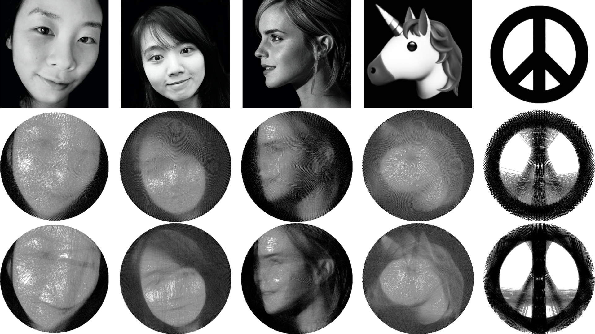

String art is an image solely composed of strings between pins
around a circular canvas. We implemented a parallelized string art
solver in C++ and CUDA that computes the string art best resembling the input image. We developed our algorithm from scratch
based on the sequential greedy approach proposed in paper by
[Brisak et al](https://www.cg.tuwien.ac.at/research/publications/2018/Birsak2018-SA/Birsak2018-SA-preprint.pdf). We modified the proposed algorithm while implementing our sequential version of the solver, so that algorithm
would have more parallelism to exploit while outputting more accurate string art image. We then developed our parallel version of
the solver, which produces the same output as the sequential solver
in a considerably shorter runtime. We were able to achieve an over
221x speedup on a 512*512 image with 128 pins.

This project was for class 15418 Parallel Computer Architecture and Programming. For more information, check out the [final report](https://cat-yu.github.io/pdf/string_art_report.pdf) and the [project page](https://nanxili.github.io/15418-threadart/).

Source: <a href="https://github.com/nanxili/15418-threadart/tree/master"><i class="large github icon"></i>15418-threadart</a>

