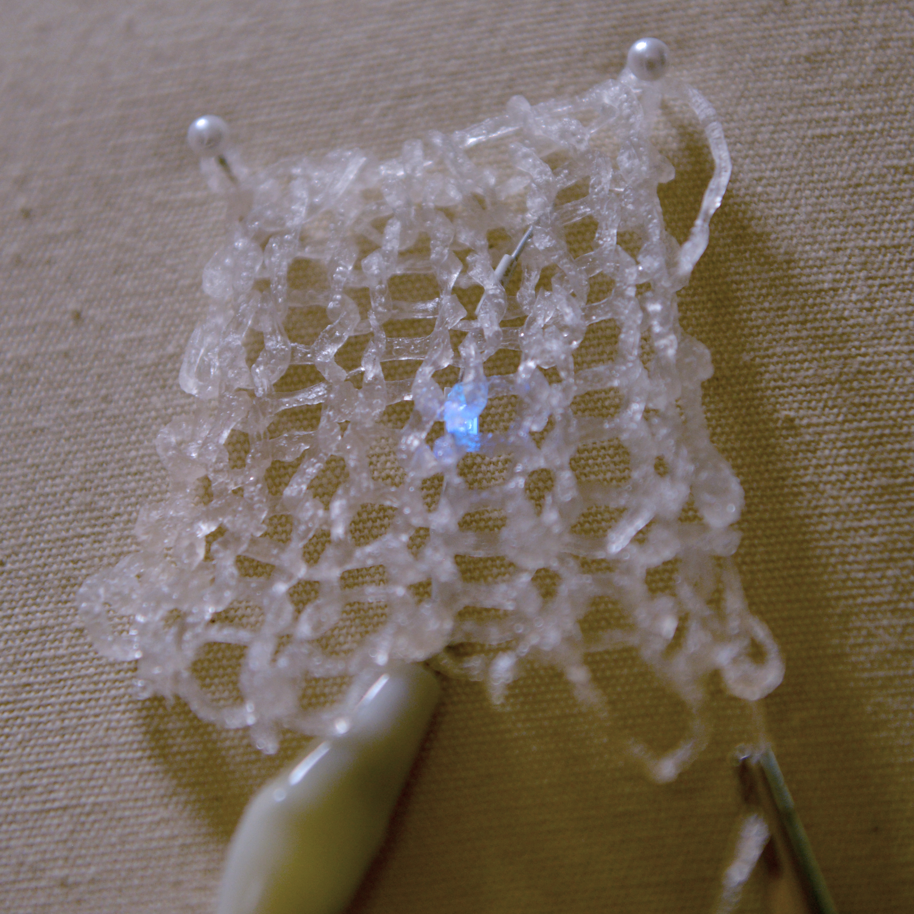

I found a [sodium alginate bioplastic yarn recipe](https://www.instructables.com/Create-Bio-yarn/) and a [conductive bioplastic recipe](https://www.youtube.com/watch?v=vn5bkwJZKpw) and was trying to play with bioplastic materials to make conductive yarn. The result was quite unexpected because adding conductive powder to bioplastic yarn didn’t make the yarn become as conductive as predicted. But what was very interesting was that I found out that the remaining water in ‘dried’ yarn is still conductive enough to light up an LED. The image above is a result image of a knitted piece, made with the conductive bioplastic yarn, lighting up an LED after it has been left in air at room temperature for over 2 weeks.

This project was for class 27505 Exploration of Everyday Materials. For more information, check out the [final report/journals](https://cat-yu.github.io/pdf/Conductive_bioplastic_yarn_report.pdf).

