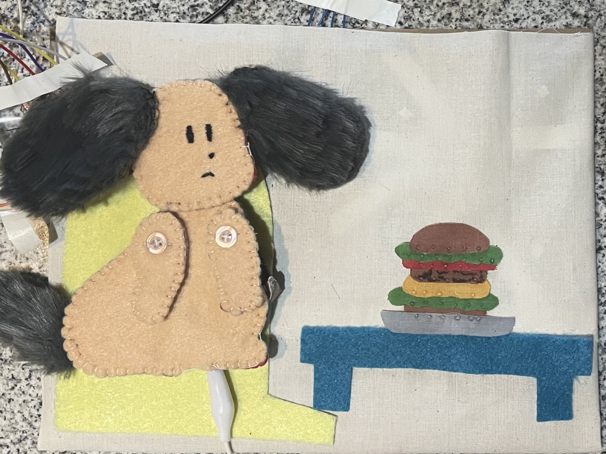
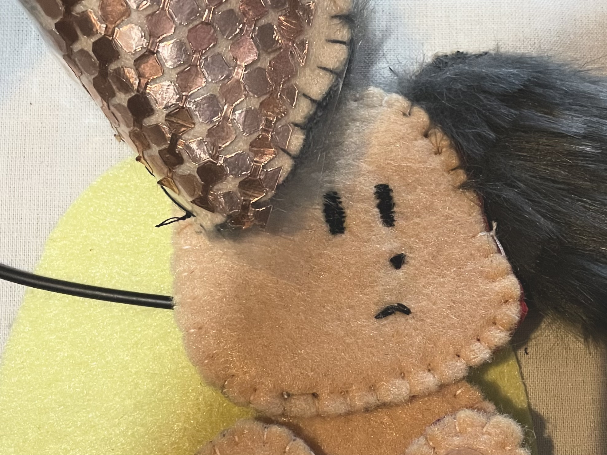

Lunch Time for the Puppy is an interactive children’s fabric book. The book is made from felt and other fabric material with different textures, and is embedded with soft sensors and electronic output elements for creating a rich storytelling experience. We produced a proof of concept prototype of the design by making one page from the book for demonstration. Our vision for the project is to have an entire book fabricated with similar methods with the main character, the detachable interactive puppy. The complete story would contain various scenarios of the puppy at places around the house.

We used a [low-cost multitouch capacitive sensing kit](https://github.com/HCI-Lab-Saarland/MultiTouchKitDoc/blob/master/MTK_Tutorial.pdf) in our project.

This project was for class 16480 Creative Sott Robotics. For more information, check out the [final documentation](https://courses.ideate.cmu.edu/16-480/s2021/3033/lunch-time-for-the-puppy-an-interactive-fabric-book/).

