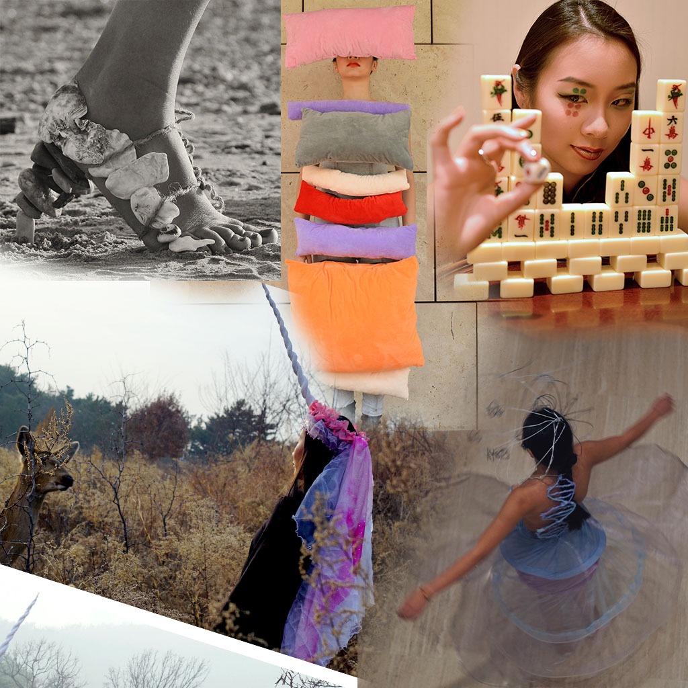

Activated Anamorphs is a "interdisciplinary studio course presents a hybrid of relationships between wearable sculpture and prosthetics, movement and identity-based performance for video and social media, and experimental fashion photography. "
In this class, I made [a beach inspired shoe design](https://cat-yu.github.io/projects/beach-inspired-shoe-design), [a mahjong inspired makeup](https://cat-yu.github.io/projects/mahjong-inspired-makeup), [a unicorn inspired headpiece](unicorn-inspired-headpiece), [a clock gene inspired full-body wearable sculpture](https://cat-yu.github.io/projects/clockgene-inspired-wearable), and [a google calender inspired full-body wearable sculpture](https://cat-yu.github.io/projects/google-calender-inspired-wearable). The clock gene project was part of [The Stream](https://www.youtube.com/watch?v=UUIPTqXy0Zo), pre-recorded for a [transition video](https://youtu.be/WkZgmIYNrB8). The google calender project was part of Window to Elsewhere, pre-recorded for a [transition video](https://youtu.be/dEC5Yqql72c), and performed [live](https://www.youtube.com/watch?v=HwfzrLkZZQU&t=1784s).

These projects were for class 60496 Activated Anamorphs:Performative Inhabitables and Interactive Prostheses.

