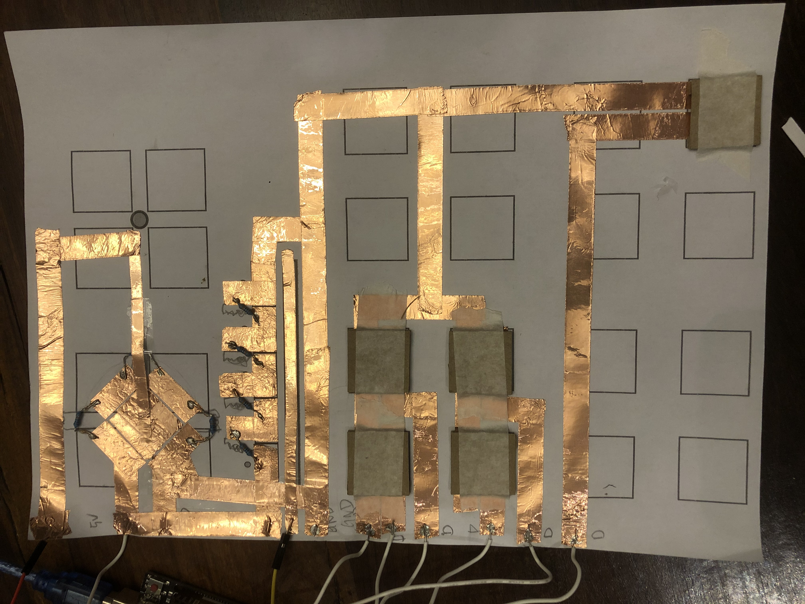

As technology advances, many interactions are drastically changing. When I came back to China, I was shocked by how mobile ordering in restaurants is widely adopted. It went from ordering with a server, to ordering using a tablet/ipad, to a table of people ordering from the same phone, to now where everyone can contribute to the same order using their own phone. Just like many people who prefer reading a paper book, I really enjoyed flipping through menus at restaurants.

However, we cannot ignore the benefit of having electronic orders: the order goes directly to the kitchen and all orders are automatically  stored digitally. To combine the paper feel of the menu and the benefit of having a digital menu, this project explores 3 ways of interactions that can be used in a interactive paper menu using paper circuits:
  - presses (equivalent to a button)
  - slider (equivalent to a linear potentiometer)
  - wheel (equivalent to a circular potentiometer)
 
For more information, see the [project documentation](https://courses.ideate.cmu.edu/48-339/f2020/?p=1964).