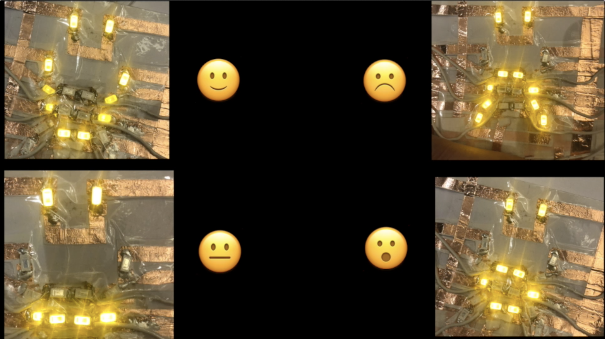

<!-- 

 -->
 
 -----
 
With Covid-19, most of in person interactions happen with masks on. What I find troublesome is that I don't see people smile any more, so I made a face mask that displays emotions with accessible touch controls.

This was a class project for 05333 Applied Gadgets Sensors
and Activity Recognition in HCI.

