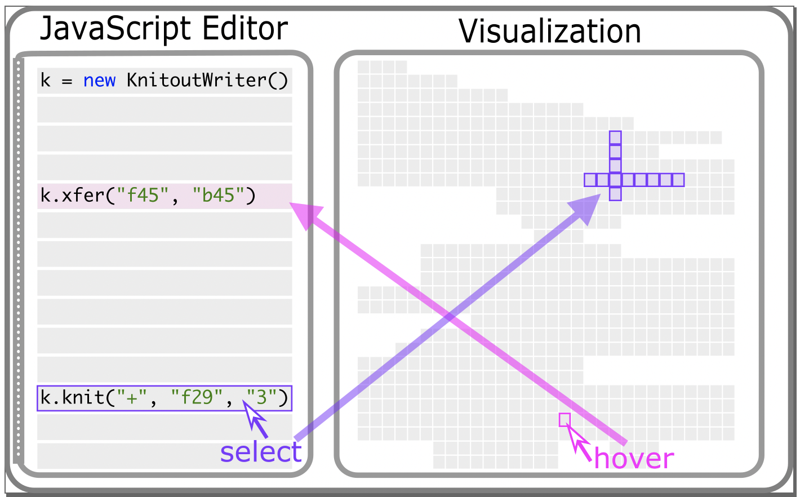

 
### Abstract
To effectively program knitting machines, like any fabrication machine, users must be able to place the code they write in correspondence with the output the machine produces. This mapping is used in the code-to-output direction to understand what their code will produce, and in the output-to-code direction to debug errors in the finished product. In this paper, we describe and demonstrate an interface that provides two-way coupling between high- or low-level knitting code and a topological visualization of the knitted output. Our system allows the user to locate the knitting machine operations generated by any selected code, as well as the code that generates any selected knitting machine operation. This link between the code and visualization has the potential to reduce the time spent in design, implementation, and debugging phases, and save material costs by catching errors before actually knitting the object. We show examples of patterns designed using our tool and describe common errors that the tool catches when used in an academic lab setting and an undergraduate course.

For more information, visit the [project page](https://textiles-lab.github.io/publications/2020-knitout-visualizer/) and the [ACM Digital Library Page](https://dl.acm.org/doi/10.1145/3424630.3425410).

Source: <a href="https://github.com/textiles-lab/knitout-live-visualizer"><i class="large github icon"></i>textiles-lab/knitout-live-visualizer</a>