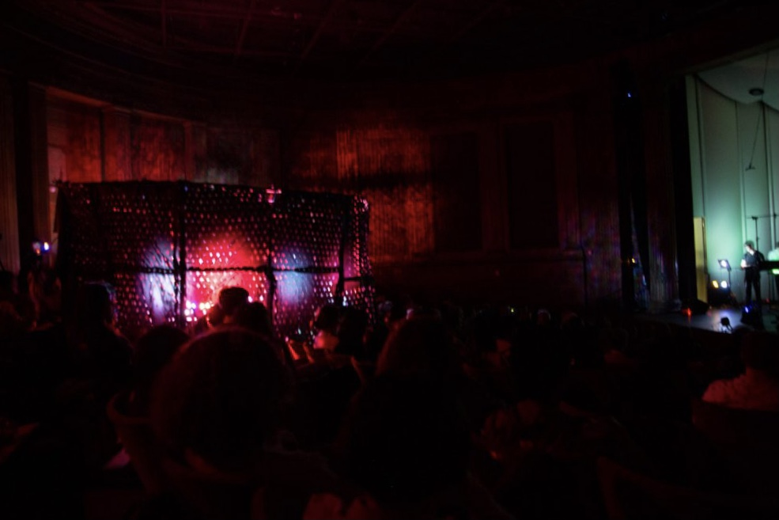
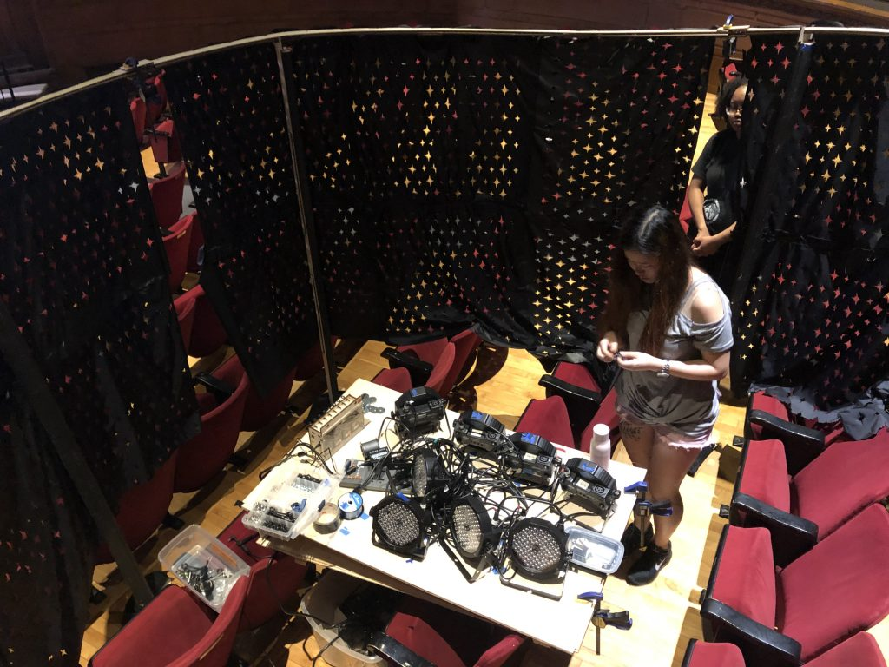
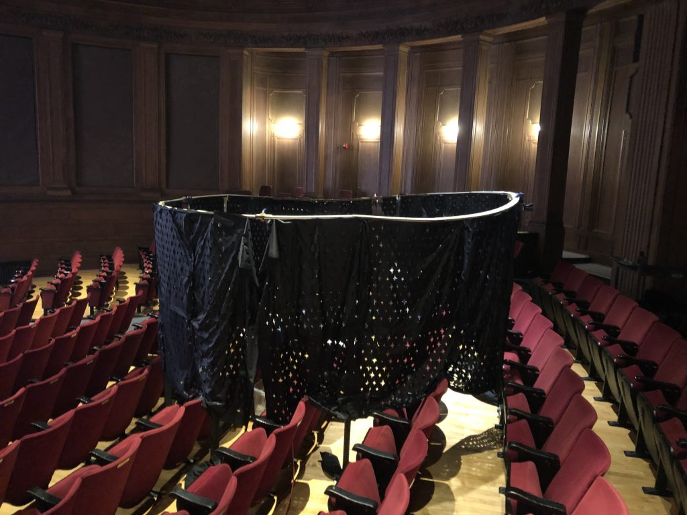

 
 -----
 
The live light show was part of [*Pushing Air*](http://www.explodedensemble.org/air), an evening of music, soft-sculpture, and textile robotics presented in two parts. After the audience was placed in total darkness, beams of colored light were projected onto the walls. They were given shape by the cutouts in the fabric. Sometimes the lights appeared all at the same time, so that the room and the audience were almost fully visible. Other times, the lights were turned on one after the other at differing paces.

We created a large portable wooden ring structure and have it support the fabric with cutouts like a canopy. The ring is placed in the middle of the concert hall, among audience. In the center of the ring structure, there is a wooden platform for the 8 DMX lights to rest on. We utilized the walls of the concert hall as projector screens. This would allow us to project light from within the ring onto the walls, creating the immersive starry night effect. In addition, movements of the fabric, which is controlled by a capstan palced on top of the wooden platform, results in subtle changes in projected light. All light changes and fabric movements were manipluted during the performance using MIDI controllers.

This was a class project for 16376 Kinetic Fabrics. For more information, see the [final reflection](https://courses.ideate.cmu.edu/16-376/s2019/2071/starry-night-final-reflection-catherine-lexi-zeja/).

Because the performance was mostly in complete darkness, we weren't able to record the performance. Below is a video of the setup process.

