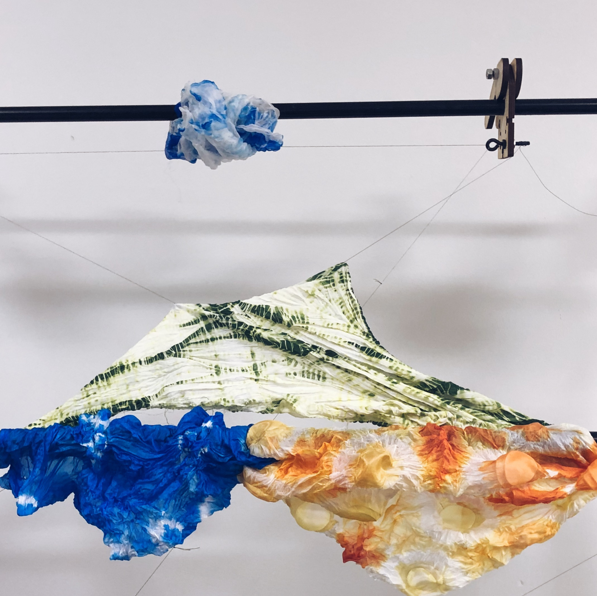

------

 
We decided to create a morphing landscape using the green fabric as a mountain, the orange as a field of flowers, the blue as water, and light blue as a cloud. The landscape would change based on vertical and horizontal motions. 

This was a class project for 16376 Kinetic Fabrics. For more information, see the [documentation](https://courses.ideate.cmu.edu/16-376/s2019/1768/expansion-contraction-and-composition-jules-and-catherine/).

