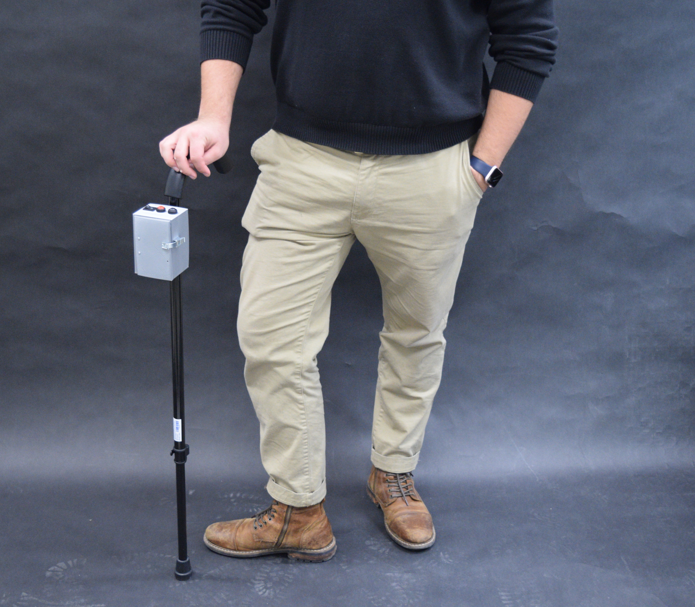
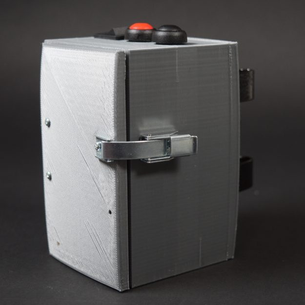
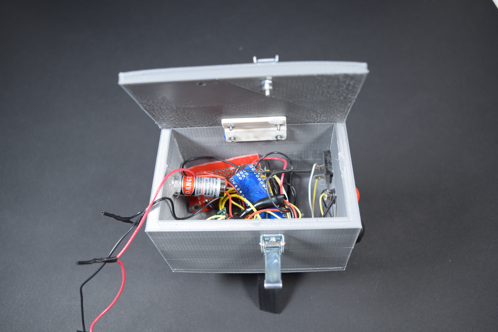
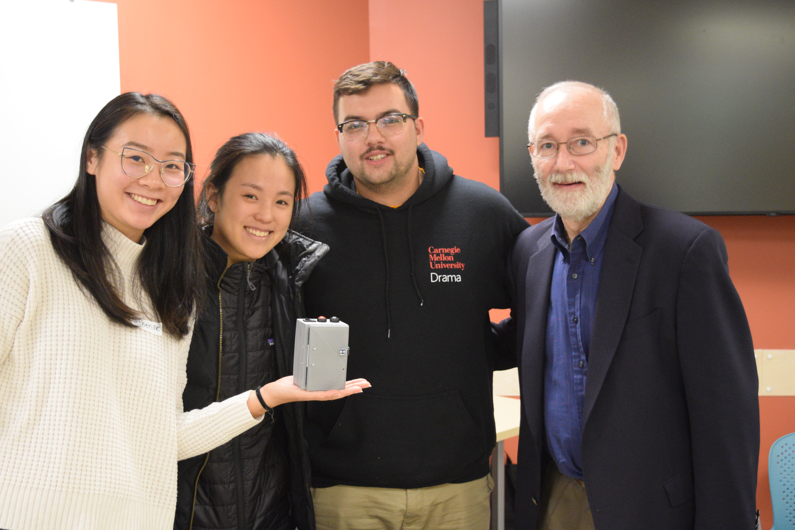

 

our team worked with Joseph, a semi-retired attorney and a Parkinson’s patient, in a collaborative effort to design and develop an assistive device that would be useful to him every day. Over the course of several weeks, we created a detachable cane assist that focused on mitigating some of Joseph’s freezing episodes, which are involuntary and temporary blocks of movement that can limit his everyday mobility. Typically, Joseph experiences freezing episodes when he is due for his next dose of medication. This accessory will be useful to him during this time when he may be more vulnerable to freezing.

This detachable cane accessory provides a visual cue (a red laser on the ground) and a haptic cue (vibrating disks). Both of these cues gives Joseph a specific target to focus on, which can help him move past a freezing episode. The cane accessory is a 3-D printed box that has buttons at the top to control the power (on/off switch), the visual cue (laser), and haptic cue (vibrating disks). In case Joseph needs to change the rechargeable batteries, we implemented a hinge and a latch that can open the box. As Joseph travels frequently to visit family across the country, we ensured that the batteries were TSA-safe.

After the class presentation, we gave the prototype to Joseph!

This was a class project for 60223 Intro to Physical Computing. For more information, see the [final documentation](https://courses.ideate.cmu.edu/60-223/f2018/work/parkinsons-cane-assist-by-team-joseph-final-documentation/).

