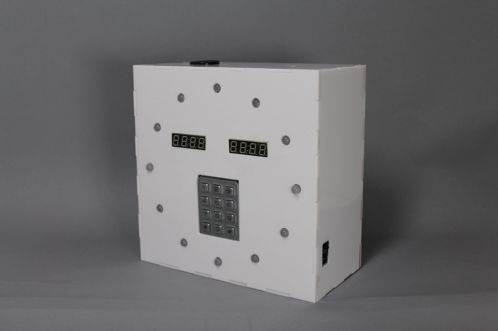
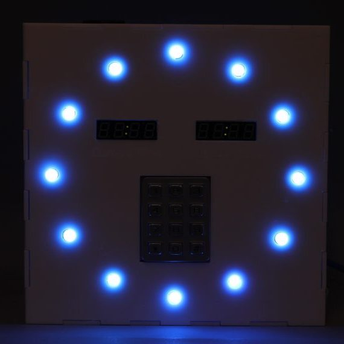

 

The original design of this project was an alarm clock that makes noises and lights up when it is the time to wake up and can be only turned off by jumping on a pressure pad attached to it.

However, due to time constraints, I was not able to complete the project like intended and I had to remove the pressure pad part out of the final product. Despite the despairing nights before the deadline, I really love the look of this!

This was a class project for 60223 Intro to Physical Computing. For more information, see the [final documentation](https://courses.ideate.cmu.edu/60-223/f2018/work/alarm-clock-that-actually-wakes-me-up/).

