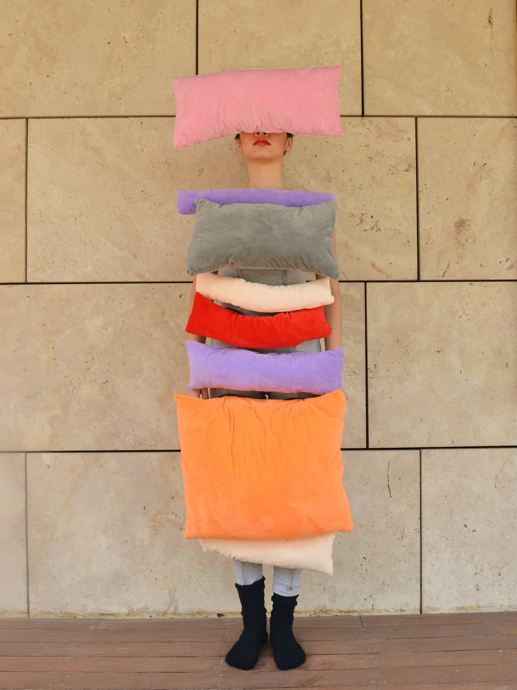
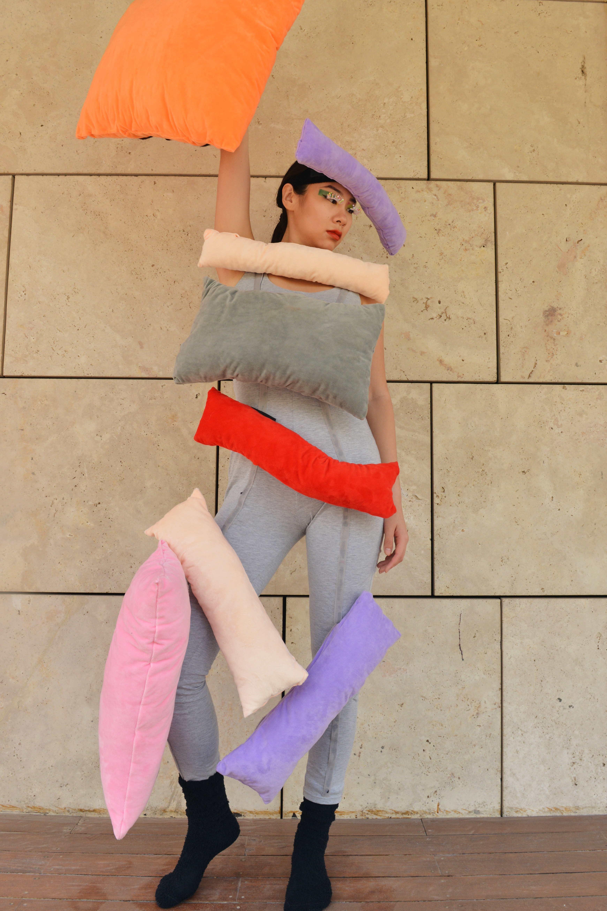
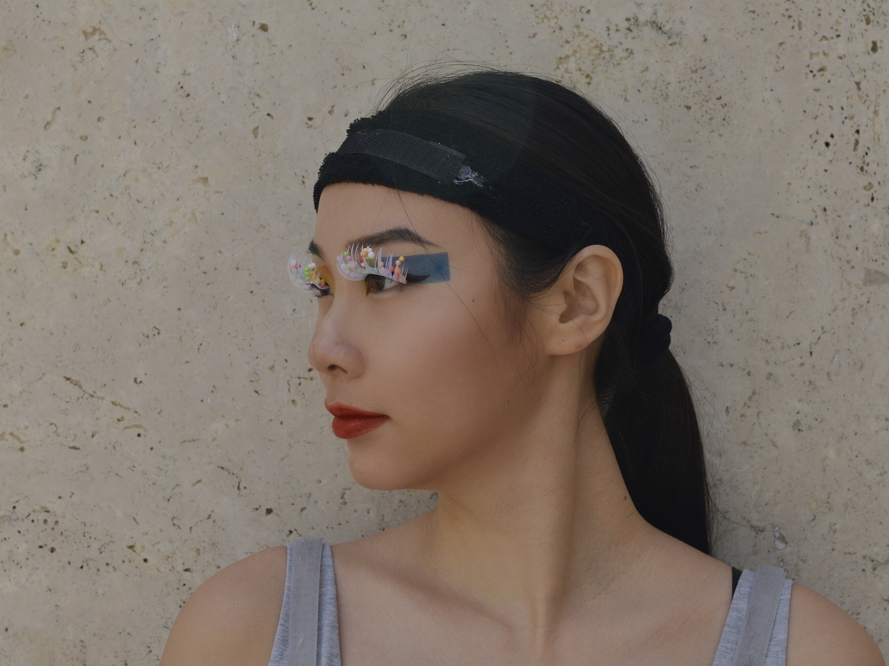

------

This project was a Google calender blocks inspired full-boby wearable sculpture. Among my many attempts to become more productive, calender blocking was a technique that worked quite well. In class, I was encouraged by Keagan Barone(TA) and Scott Andrew(instructor) to integrate pole dancing to my performance. The video above is the pre-recorded pole dancing performance, and I performed wearing the sculpture live as part of [Window to Elsewhere](https://www.youtube.com/watch?v=HwfzrLkZZQU&t=1784s).

This projects was for class 60496 Activated Anamorphs:Performative Inhabitables and Interactive Prostheses.

