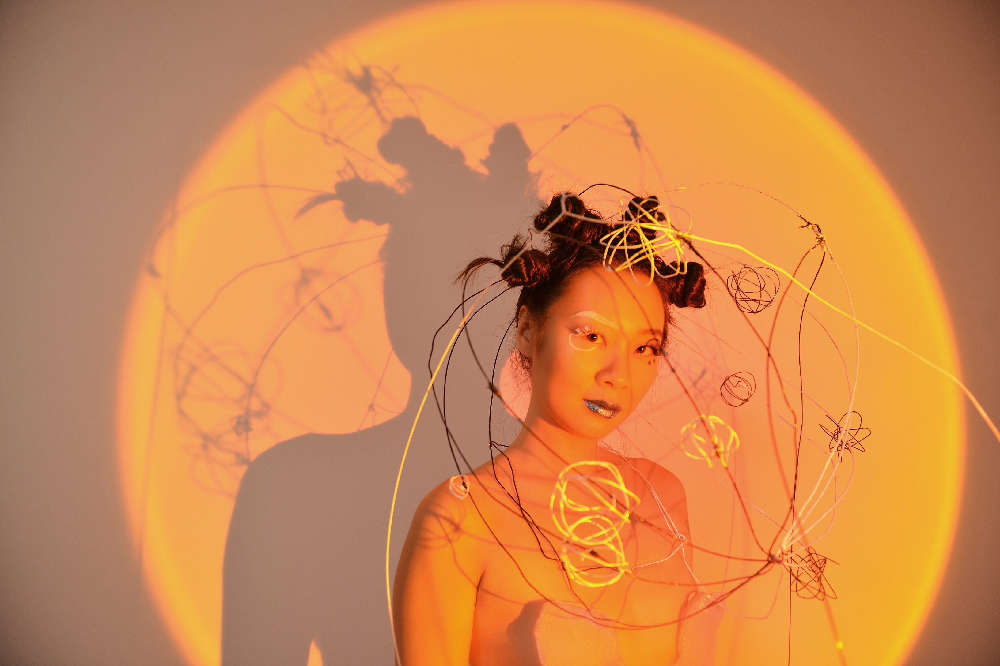
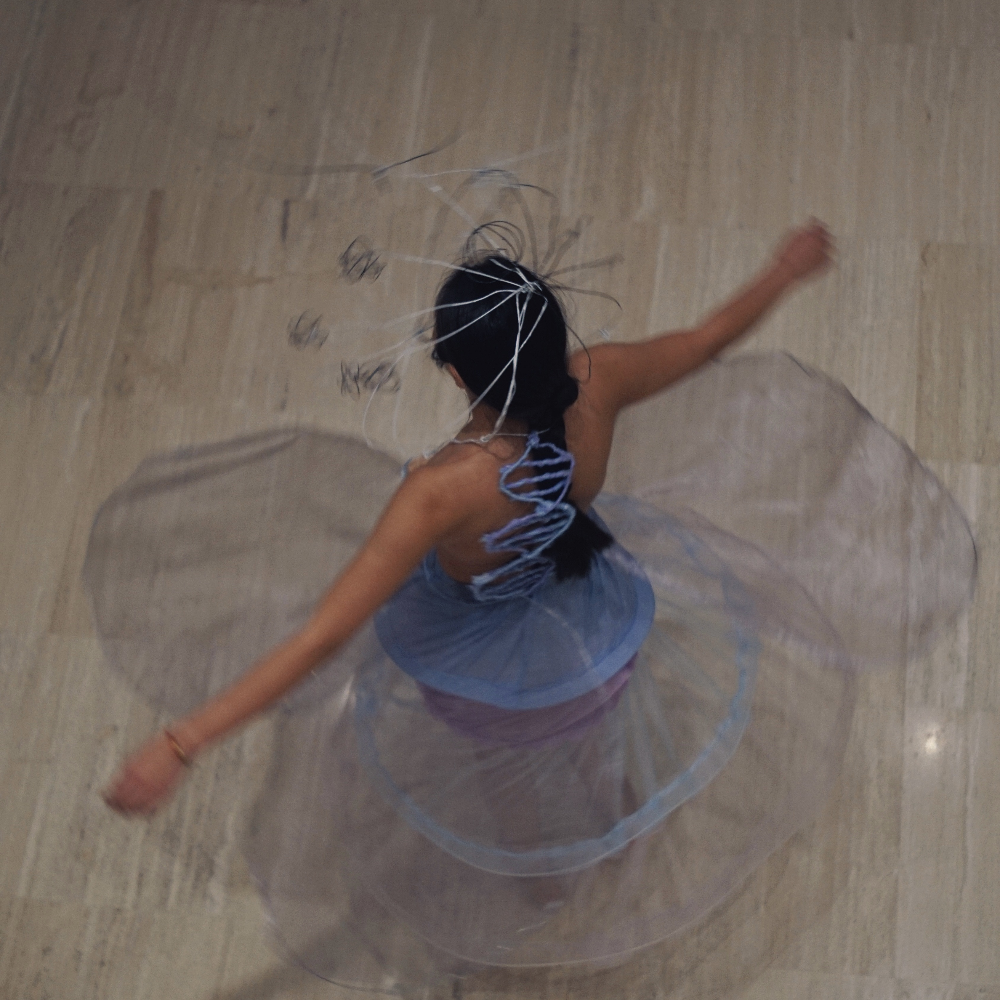

------

This project was a [clock gene](https://en.wikipedia.org/wiki/CLOCK) inspired full-boby wearable sculpture. The project was also to remember Spring 2021: I was living in China, attending live lectures in the U.S., and consistenly living in a timezone somewhere in Europe. I was constantly concernd with my health, and this project gave me the oppurtunity to explore circadian cycles. 

This projects was for class 60496 Activated Anamorphs:Performative Inhabitables and Interactive Prostheses.

