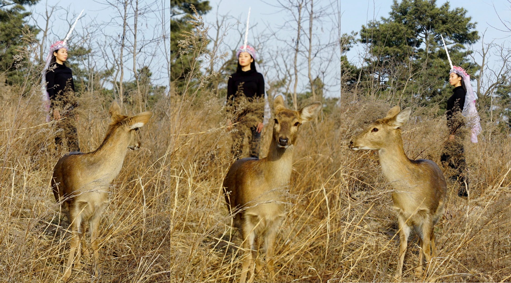
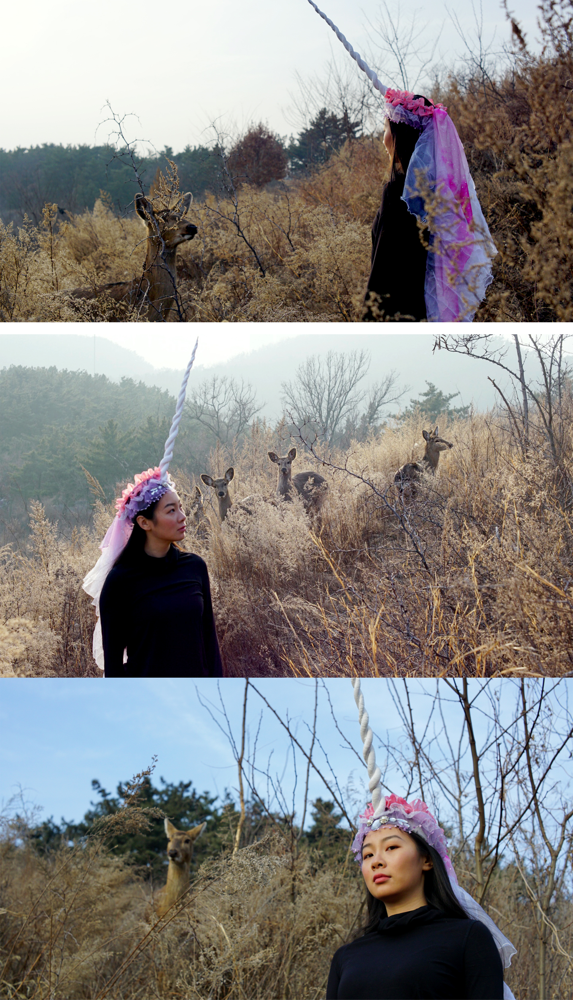
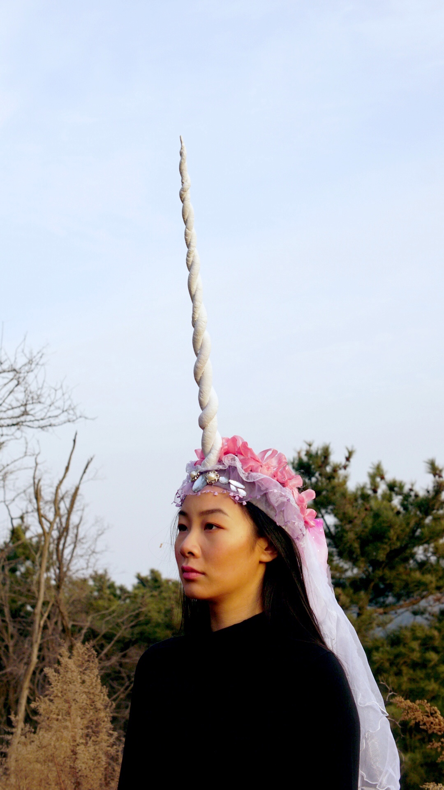

This project was a unicorn inspired headpiece design. These photos are taken in the mountains with wild deers.

This projects was for class 60496 Activated Anamorphs:Performative Inhabitables and Interactive Prostheses.

